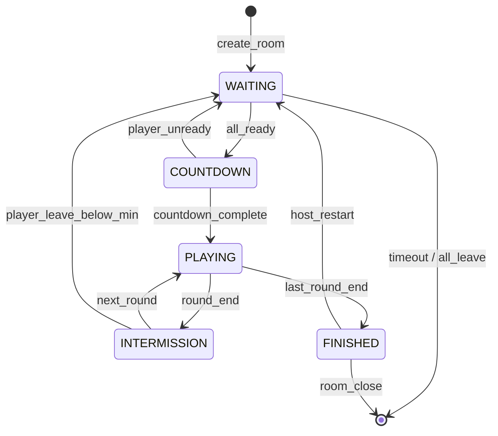
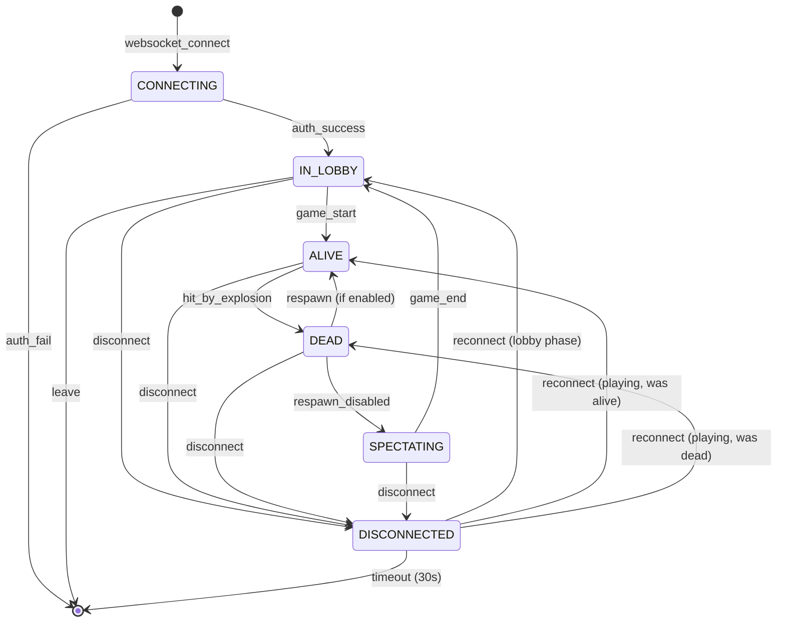

# Bomberman Online - State Machine Diagrams

## Overview

This document defines the state machines that govern game behavior, including room lifecycle, player states, game phase transitions, and entity states.

---

## 1. Room Lifecycle State Machine

### ASCII Diagram

```
                              ┌─────────────────────────────────────────┐
                              │                                         │
                              ▼                                         │
┌─────────┐    create    ┌─────────┐    all_ready    ┌───────────┐     │
│  EMPTY  │─────────────►│ WAITING │───────────────►│ COUNTDOWN │     │
└─────────┘              └────┬────┘                 └─────┬─────┘     │
                              │                            │           │
                              │ timeout/                   │ timer=0   │
                              │ all_leave                  │           │
                              │                            ▼           │
                              │                      ┌──────────┐      │
                              │                      │ PLAYING  │      │
                              │                      └────┬─────┘      │
                              │                           │            │
                              │            ┌──────────────┴────────────┤
                              │            │                           │
                              │   one_alive│                last_round │
                              │   /timeout │                           │
                              │            ▼                           │
                              │     ┌──────────────┐    not_last  ┌────┴─────┐
                              │     │ INTERMISSION │──────────────│ FINISHED │
                              │     └──────┬───────┘              └────┬─────┘
                              │            │                           │
                              │            │ timer_done                │
                              │            │ && not_last               │
                              │            │                           │
                              │            ▼                           │
                              │       ┌─────────┐                      │
                              └───────│ WAITING │◄─────────────────────┘
                                      └─────────┘     host_restart
```

### Mermaid Diagram



### State Definitions

| State | Description | Duration |
|-------|-------------|----------|
| `WAITING` | Room created, accepting players | Until all ready or 10min timeout |
| `COUNTDOWN` | All players ready, starting soon | 3 seconds |
| `PLAYING` | Active gameplay | Until 1 player alive or time limit |
| `INTERMISSION` | Between rounds, showing results | 3.5 seconds |
| `FINISHED` | Match complete, showing final results | Until host action or 60s |

### Transitions

| From | To | Trigger | Actions |
|------|----|---------|---------
| `WAITING` | `COUNTDOWN` | All players ready (min 2) | Start 3s countdown, lock room |
| `COUNTDOWN` | `WAITING` | Player unready/leave | Cancel countdown, unlock room |
| `COUNTDOWN` | `PLAYING` | Countdown reaches 0 | Initialize game state, spawn players |
| `PLAYING` | `INTERMISSION` | ≤1 player alive OR time limit | Record winner, update scores |
| `PLAYING` | `FINISHED` | Final round complete | Calculate final standings, ELO |
| `INTERMISSION` | `PLAYING` | Timer expires | Reset board, respawn players |
| `FINISHED` | `WAITING` | Host clicks "Play Again" | Reset all state |
| Any | `CLOSED` | All players leave | Cleanup room resources |

---

## 2. Player State Machine

### ASCII Diagram

```
                     ┌─────────────────────────────────────────────────────┐
                     │                                                     │
                     ▼                                                     │
┌────────────┐   join    ┌────────────┐   game_start   ┌─────────────┐    │
│ CONNECTING │──────────►│  IN_LOBBY  │───────────────►│    ALIVE    │    │
└────────────┘           └─────┬──────┘                └──────┬──────┘    │
                               │                              │           │
                               │ disconnect                   │ hit_by    │
                               │                              │ explosion │
                               ▼                              │           │
                     ┌────────────────┐                       ▼           │
                     │ DISCONNECTED   │◄─────────┐     ┌───────────┐      │
                     └───────┬────────┘          │     │   DEAD    │      │
                             │                   │     └─────┬─────┘      │
                             │ reconnect         │           │            │
                             │ (within 30s)      │ disconnect│            │
                             │                   │           │ round_end  │
                             ▼                   │           ▼            │
                        ┌─────────┐              │    ┌─────────────┐     │
                        │ ALIVE / │              └────│ SPECTATING  │─────┘
                        │ DEAD    │                   └─────────────┘
                        └─────────┘                         │
                                                            │ game_end
                                                            ▼
                                                     ┌─────────────┐
                                                     │  IN_LOBBY   │
                                                     └─────────────┘
```

### Mermaid Diagram



### State Definitions

| State | Description | Can Input | Visible |
|-------|-------------|-----------|---------|
| `CONNECTING` | WebSocket connected, authenticating | No | No |
| `IN_LOBBY` | In room, waiting for game | Ready toggle | Yes (lobby) |
| `ALIVE` | Active in game | Full controls | Yes (game) |
| `DEAD` | Eliminated this round | None | Yes (ghost) |
| `SPECTATING` | Watching after elimination | Camera only | No (to players) |
| `DISCONNECTED` | Lost connection, can reconnect | None | Yes (frozen) |

### Player Data by State

```typescript
interface PlayerByState {
  CONNECTING: {
    connectionId: string;
    token: string;
  };

  IN_LOBBY: {
    id: string;
    name: string;
    avatarUrl: string;
    isReady: boolean;
    isHost: boolean;
  };

  ALIVE: {
    position: Position;
    direction: Direction;
    velocity: number;
    stats: PlayerStats;
    powerups: PowerupEffects;
    activeBombs: number;
  };

  DEAD: {
    position: Position;  // Death location
    killedBy: string | null;
    placement: number;
    timeOfDeath: number;
  };

  SPECTATING: {
    focusPlayerId: string | null;
    cameraPosition: Position;
  };

  DISCONNECTED: {
    previousState: PlayerState;
    disconnectedAt: number;
    reconnectToken: string;
  };
}
```

---

## 3. Game Phase State Machine

### ASCII Diagram

```
                                    ┌────────────────────────────────────────────┐
                                    │           GAME PHASE STATE MACHINE          │
                                    └────────────────────────────────────────────┘

    ┌─────────────────────────────────────────────────────────────────────────────────────────┐
    │                                                                                         │
    │    ┌────────────┐          ┌─────────────┐          ┌────────────┐                     │
    │    │            │  ready   │             │  done    │            │                     │
    │    │   SETUP    │─────────►│  COUNTDOWN  │─────────►│   ACTIVE   │                     │
    │    │            │          │   (3..0)    │          │            │                     │
    │    └──────┬─────┘          └─────────────┘          └─────┬──────┘                     │
    │           │                                                │                           │
    │           │ not_ready                                     │ end_condition              │
    │           │                                                │                           │
    │           ▼                                                ▼                           │
    │    ┌────────────┐                                   ┌────────────┐                     │
    │    │   SETUP    │◄──────────────────────────────────│   RESULT   │                     │
    │    └────────────┘           new_round               └─────┬──────┘                     │
    │                                                           │                           │
    │                                                           │ final_round               │
    │                                                           ▼                           │
    │                                                    ┌────────────┐                     │
    │                                                    │   FINAL    │                     │
    │                                                    └────────────┘                     │
    │                                                                                         │
    └─────────────────────────────────────────────────────────────────────────────────────────┘
```

### Detailed Phase Breakdown

```
SETUP PHASE
├── Initialize map
├── Assign spawn positions
├── Reset player stats
└── Broadcast initial state

    │
    │ All players confirm ready
    ▼

COUNTDOWN PHASE (3 seconds)
├── Tick 0: Display "3"
├── Tick 20: Display "2"  (1 second)
├── Tick 40: Display "1"  (2 seconds)
└── Tick 60: Display "GO!" (3 seconds)

    │
    │ Countdown complete
    ▼

ACTIVE PHASE (180 seconds default)
├── Process inputs
├── Update physics
├── Handle bombs/explosions
├── Check death conditions
├── Spawn powerups
└── Broadcast state

    │
    │ End condition met
    │ (≤1 alive OR time limit)
    ▼

RESULT PHASE (3.5 seconds)
├── Calculate round winner
├── Update round scores
├── Award kill credits
├── Broadcast results
└── Check if final round

    │                    │
    │ Not final round    │ Final round
    ▼                    ▼

SETUP PHASE          FINAL PHASE
(repeat)             ├── Calculate match winner
                     ├── Update ELO ratings
                     ├── Record match history
                     ├── Save replay
                     └── Broadcast final results
```

---

## 4. Bomb State Machine

### ASCII Diagram

```
                    ┌───────────────────────────────────────────────┐
                    │              BOMB STATE MACHINE                │
                    └───────────────────────────────────────────────┘

┌───────────┐  place   ┌───────────┐  fuse_done   ┌─────────────┐  duration   ┌───────────┐
│   NONE    │─────────►│  PLANTED  │─────────────►│  EXPLODING  │────────────►│  REMOVED  │
└───────────┘          └─────┬─────┘              └─────────────┘             └───────────┘
                             │                           ▲
                             │ chain_reaction            │
                             └───────────────────────────┘


Timeline:
─────────────────────────────────────────────────────────────────────────────►
│                                   │                     │
│◄─────── Fuse: 2200ms ────────────►│◄── Explode: 600ms ─►│
│                                   │                     │
Plant                           Detonate              Cleanup
```

### State Definitions

| State | Duration | Visual | Collision |
|-------|----------|--------|-----------|
| `PLANTED` | 2200ms | Bomb sprite + wobble | Blocks movement |
| `EXPLODING` | 600ms | Explosion flames | Damages players |
| `REMOVED` | 0 | None | None |

### Bomb Properties

```typescript
interface BombStateMachine {
  states: {
    PLANTED: {
      position: Position;
      ownerId: string;
      radius: number;
      plantedAt: number;
      fuseTime: number;  // 2200ms default
    };

    EXPLODING: {
      cells: Position[];  // All affected cells
      startedAt: number;
      duration: number;   // 600ms
      chainDepth: number; // For visual effects
    };

    REMOVED: {
      // Bomb reference cleaned up
    };
  };

  transitions: {
    'PLANTED -> EXPLODING': 'fuse_expired | chain_triggered';
    'EXPLODING -> REMOVED': 'duration_expired';
  };
}
```

### Chain Explosion Logic

```
Bomb A explodes at t=0
     │
     ├── Check cells in radius
     │   └── Find Bomb B in explosion range
     │
     ├── Trigger Bomb B immediately (t=0, not after fuse)
     │   └── chainDepth = A.chainDepth + 1
     │
     └── Continue recursively
```

---

## 5. Powerup State Machine

### ASCII Diagram

```
┌───────────┐  destroy_block   ┌───────────┐  player_touch   ┌───────────┐
│   NONE    │─────────────────►│  SPAWNED  │────────────────►│ COLLECTED │
└───────────┘                  └─────┬─────┘                 └───────────┘
      ▲                              │
      │                              │ explosion_hit
      │                              │
      └──────────────────────────────┘
                 destroyed
```

### Spawn Probability

```typescript
const POWERUP_SPAWN_CONFIG = {
  spawnChance: 0.25,  // 25% chance when soft block destroyed

  distribution: {
    'bomb_up':   0.30,  // +1 max bombs
    'fire_up':   0.30,  // +1 explosion radius
    'speed_up':  0.20,  // +movement speed
    'kick':      0.08,  // Kick bombs
    'punch':     0.07,  // Throw bombs
    'shield':    0.03,  // One-hit protection
    'skull':     0.02,  // Random effect (debuff)
  }
};
```

---

## 6. Connection State Machine

### ASCII Diagram

```
┌─────────────────────────────────────────────────────────────────────────────┐
│                        CONNECTION STATE MACHINE                              │
└─────────────────────────────────────────────────────────────────────────────┘

                              ┌──────────────┐
                              │  CONNECTING  │
                              └──────┬───────┘
                                     │
               ┌─────────────────────┼─────────────────────┐
               │                     │                     │
               ▼                     ▼                     ▼
        ┌────────────┐       ┌─────────────┐       ┌─────────────┐
        │ AUTH_FAIL  │       │   AUTHED    │       │  TIMEOUT    │
        └────────────┘       └──────┬──────┘       └─────────────┘
                                    │
                                    ▼
                             ┌─────────────┐
                             │   ACTIVE    │◄─────────────────┐
                             └──────┬──────┘                  │
                                    │                         │
                    ┌───────────────┼───────────────┐        │
                    │               │               │        │
                    ▼               ▼               ▼        │
             ┌───────────┐  ┌─────────────┐  ┌──────────┐    │
             │  CLOSED   │  │   ERRORED   │  │  STALE   │    │
             │ (normal)  │  │  (error)    │  │(no ping) │    │
             └───────────┘  └─────────────┘  └────┬─────┘    │
                                                   │          │
                                                   │ ping_ok  │
                                                   └──────────┘
```

### Heartbeat Protocol

```
Client                              Server
   │                                   │
   │◄──────── ping (every 5s) ─────────│
   │                                   │
   │──────── pong ────────────────────►│
   │                                   │
   │    [If no pong within 15s]        │
   │                                   │
   │         Connection marked STALE   │
   │                                   │
   │    [If no pong within 30s]        │
   │                                   │
   │         Connection closed         │
```

---

## 7. Matchmaking Queue State Machine

### ASCII Diagram

```
                    ┌───────────────────────────────────────────────┐
                    │        MATCHMAKING QUEUE STATE MACHINE        │
                    └───────────────────────────────────────────────┘

┌───────────┐  queue   ┌───────────┐  match_found   ┌───────────────┐
│   IDLE    │─────────►│  QUEUED   │───────────────►│   MATCHED     │
└───────────┘          └─────┬─────┘                └───────┬───────┘
      ▲                      │                              │
      │                      │ cancel                       │ all_accept
      │                      │                              │
      │                      ▼                              ▼
      │                ┌───────────┐                 ┌─────────────┐
      │                │ CANCELLED │                 │  CONFIRMED  │
      │                └───────────┘                 └──────┬──────┘
      │                                                     │
      │                                                     │ join_room
      │                                                     │
      └─────────────────────────────────────────────────────┘
                              in_game

Player State in Queue:
┌────────────────────────────────────────────────────────────────────┐
│ State: QUEUED                                                       │
│ ├── queuedAt: timestamp                                            │
│ ├── eloRating: 1500                                                │
│ ├── searchRange: {min: 1400, max: 1600}                           │
│ └── expandsAt: [timestamp+30s, timestamp+60s, timestamp+90s]      │
└────────────────────────────────────────────────────────────────────┘

Range Expansion Over Time:
├── 0-30s:   ±100 ELO
├── 30-60s:  ±200 ELO
├── 60-90s:  ±300 ELO
└── 90s+:    ±500 ELO (max)
```

---

## 8. Round State Machine (Detailed)

### Round Flow Diagram

```
                          ┌─────────────────────────────────────────┐
                          │         ROUND STATE MACHINE              │
                          └─────────────────────────────────────────┘

    Round N                                                     Round N+1
        │                                                           │
        ▼                                                           │
┌───────────────┐                                                   │
│  ROUND_START  │──────────────────────────────────────────────────►│
├───────────────┤                                                   │
│ • Generate map│                                                   │
│ • Place spawns│                                                   │
│ • Reset stats │                                                   │
└───────┬───────┘                                                   │
        │                                                           │
        ▼                                                           │
┌───────────────┐                                                   │
│   COUNTDOWN   │ 3... 2... 1... GO!                               │
└───────┬───────┘                                                   │
        │                                                           │
        ▼                                                           │
┌───────────────┐                                                   │
│    ACTIVE     │◄─────────┐                                        │
├───────────────┤          │                                        │
│ • Process     │  still   │                                        │
│   inputs      │  playing │                                        │
│ • Game logic  ├──────────┘                                        │
│ • State sync  │                                                   │
└───────┬───────┘                                                   │
        │                                                           │
        │ end_condition                                             │
        │ (≤1 alive OR timeout)                                    │
        ▼                                                           │
┌───────────────┐          ┌───────────────┐                        │
│  ROUND_END    │──────────│    RESULTS    │────────────────────────┘
├───────────────┤          ├───────────────┤       (if not final)
│ • Stop inputs │          │ • Show winner │
│ • Freeze game │          │ • Update score│
│ • Calc winner │          │ • 3.5s delay  │
└───────────────┘          └───────────────┘
                                   │
                                   │ (if final round)
                                   ▼
                           ┌───────────────┐
                           │  MATCH_END    │
                           ├───────────────┤
                           │ • Final scores│
                           │ • ELO update  │
                           │ • Save replay │
                           │ • Achievements│
                           └───────────────┘
```

---

## Implementation Notes

### State Persistence

```typescript
// States that need persistence to Redis (for reconnection)
const PERSISTENT_STATES = [
  'room.state',
  'room.settings',
  'player.state',
  'player.stats',
  'game.phase',
  'game.scores',
];

// States that are ephemeral (recreatable)
const EPHEMERAL_STATES = [
  'bomb.positions',
  'explosion.active',
  'powerup.spawned',
  'player.position',
];
```

### State Validation

```typescript
// Valid state transitions (enforced by server)
const VALID_TRANSITIONS: Record<string, string[]> = {
  'room.WAITING': ['COUNTDOWN', 'CLOSED'],
  'room.COUNTDOWN': ['PLAYING', 'WAITING'],
  'room.PLAYING': ['INTERMISSION', 'FINISHED'],
  'room.INTERMISSION': ['PLAYING', 'WAITING'],
  'room.FINISHED': ['WAITING', 'CLOSED'],

  'player.IN_LOBBY': ['ALIVE', 'DISCONNECTED'],
  'player.ALIVE': ['DEAD', 'DISCONNECTED'],
  'player.DEAD': ['SPECTATING', 'ALIVE', 'DISCONNECTED'],
  'player.SPECTATING': ['IN_LOBBY', 'DISCONNECTED'],
  'player.DISCONNECTED': ['IN_LOBBY', 'ALIVE', 'DEAD', 'REMOVED'],
};
```

### Event Emission

Each state transition emits events for:
1. **Logging** - State change audit trail
2. **Broadcasting** - Client notification
3. **Replay Recording** - Reproducible game history
4. **Analytics** - Game metrics collection
